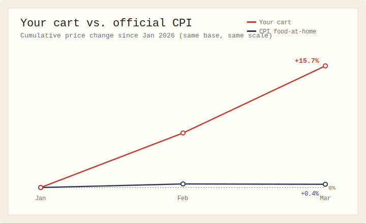

# Cart Creep

**▶ Live demo — [apps.charliekrug.com/cart-creep](https://apps.charliekrug.com/cart-creep/)**

The grocery inflation calculator for your real cart. Log what you paid for the
same short list of groceries each month and watch your personal inflation line
pull away from the official CPI.

[](https://github.com/ctkrug/cart-creep/actions/workflows/ci.yml)
[](LICENSE)



## Who it's for

Anyone who does the weekly shop, has watched the total climb, and doesn't buy
that "inflation is only a few percent." The national number is an average across
thousands of products and every household in the country. Your cart is not
average. Cart Creep measures the cart you actually buy.

## What it does

You pick up to ten grocery items you buy regularly and log what you paid once a
month. After your second month, Cart Creep plots two lines on one chart from the
same starting point and the same scale:

- **Your cart:** the total cost of your tracked items, indexed to your first month.
- **Official CPI:** the BLS CPI-U food-at-home series (`CUUR0000SAF11`), on the
  same base so the two are directly comparable.

The gap between the lines is your answer to "am I paying more than the CPI says?"
A per-item breakdown then ranks which groceries are driving your personal
inflation, highest first.

Everything runs in the browser. Nothing you type ever leaves your device.

## Features

- **Two-line comparison chart:** your cost-of-cart index against the real BLS
  food-at-home series, sharing one axis, drawing in on first render. Hover or tap
  any point for its exact month and value.
- **Per-item creep breakdown:** first-to-latest percentage change for each item,
  ranked, so you can see it's the coffee and eggs, not the whole cart.
- **Price history table:** every logged price, by item and month.
- **Inline validation:** the add-item and log-price forms explain what's wrong in
  place, with no browser `alert()` popups.
- **Export / import:** save your history to a JSON file and load it back, with a
  confirm step before an import overwrites anything.
- **Type-to-confirm clear:** erasing all data takes a deliberate `CLEAR`.
- **Private by design:** persisted in `localStorage`; no account, no server, no sync.

## Usage

1. Add up to ten grocery items you buy regularly (milk, eggs, coffee, ground
   beef, whatever makes up your real cart).
2. Once a month, log what you paid for each one. Log every item each month for an
   accurate comparison; a month with only some items priced looks cheaper than it
   really was.
3. After your second month, read the chart. If your red line is steeper than the
   blue one, your groceries are outpacing the official index, and the breakdown
   tells you which items are to blame.

## Development

```sh
npm install
npm run dev            # local dev server
npm test               # run the test suite (Vitest, jsdom)
npm run test:coverage  # tests with v8 line coverage
npm run lint           # ESLint
npm run build          # static build to site/
```

## Stack

Vanilla JavaScript with `localStorage` for persistence,
[Vite](https://vitejs.dev) for the dev server and static build, and
[Vitest](https://vitest.dev) for tests. No backend, no framework. See
[`docs/ARCHITECTURE.md`](docs/ARCHITECTURE.md) for how the modules fit together
and [`docs/DESIGN.md`](docs/DESIGN.md) for the visual direction.

## License

MIT. See [LICENSE](LICENSE).

---

More of Charlie's projects → [apps.charliekrug.com](https://apps.charliekrug.com)
